# Detection_fake_news
Repo du projet NLP

AVANT DE COMMENCER:
récupérer les 2 zip sur Teams et les placer dans style_branch 

organisation du projet:

Le projet contient plusieurs branches:
- la knowledge_branch contient tous les fichiers .py et .ipynb sur la détection de fake news grâce à la méthode knowledge-based
- la style_branch contient tous les fichiers .py et .ipynb sur la détection de fake news grâce à la méthode style-based
- la fusion_branch va servir pour combiner les résultats des deux méthodes 


Data news media : https://onlineacademiccommunity.uvic.ca/isot/2022/11/27/fake-news-detection-datasets/
Data tweeter : https://www.kaggle.com/competitions/nlp-getting-started/data?select=test.csv
Data LIAR kaggle : https://www.kaggle.com/datasets/doanquanvietnamca/liar-dataset/data


TODO :
    - style based :
        Besoin de refaire un fine-tuning et apprentissage
        Besoin de faire une architecture plus propre pour le projet (data et style_branch)

## Arborescence du repertoire

```text
Detection_fake_news/
├── main.ipynb
├── unzip.py
│
├── data/
│   ├── data_extraction.py
│   ├── dataset.csv
│   ├── complete_train.csv
│   ├── block_A_roberta_train.csv
│   ├── block_B_train.csv
│   ├── block_C_final_test.csv
│   ├── block_B_train_WITH_PROB.csv
│   └── block_C_final_test_WITH_PROB.csv
│
├── style_branch/
│   ├── feature_extraction.py
│   ├── style_extractor.py
│   ├── print_features.py
│   ├── split_data.py
│   ├── fine_tunning.py
│   ├── test_fine_tuned.py
│   ├── model_comp.py
│   ├── result_roberta.py
│   └── inference_pipeline.py
│
├── knowledge_branch/
│   ├── claim_detection.py
│   ├── claim_verification.py
│   ├── evidence_retrieval.py
│   ├── knowledge.ipynb
│   └── knowledge_based_tests.ipynb
│
├── fusion_branch/
│   └── classifier.py
│
├── scripts_venv/
│   └── start_env.ps1
│
├── test_latex/
│   └── test.tex
│
└── README.md
```

### Descriptions detaillees

**Racine du projet**

| Fichier | Description |
|---------|-------------|
| `main.ipynb` | Notebook orchestrateur qui lance le pipeline principal en 5 phases |
| `unzip.py` | Script de decompression des archives de donnees téléchargées |
| `README.md` | Documentation générale du projet |

**data/** — Donnees et script d'extraction

| Fichier | Description |
|---------|-------------|
| `data_extraction.py` | Fusion et harmonisation des 4 datasets sources (LIAR, Twitter, UoVictoria) |
| `dataset.csv` | Dataset fusionne : texte + label binaire (0=vrai, 1=faux) |
| `complete_train.csv` | Dataset enrichi avec les 20+ metriques stylometriques |
| `block_A_roberta_train.csv` | Sous-ensemble pour fine-tuning DistilRoBERTa (60% des donnees) |
| `block_B_train.csv` | Sous-ensemble pour l'entraînement Random Forest/XGBoost (20% des donnees) |
| `block_C_final_test.csv` | Sous-ensemble pour test final avant predictions RoBERTa (20% des donnees) |
| `block_B_train_WITH_PROB.csv` | Bloc B enrichi avec `roberta_proba` (probabilite RoBERTa) |
| `block_C_final_test_WITH_PROB.csv` | Bloc C enrichi avec `roberta_proba` |

**style_branch/** — Methode style-based et fusion

| Fichier | Description |
|---------|-------------|
| `style_extractor.py` | Classe qui calcule les indicateurs linguistiques : longueur, densité de ponctuation, ratio emoticon, sentiments, richesse lexicale, etc. |
| `feature_extraction.py` | Script batch pour appliquer `StyleExtractor` au dataset complet |
| `print_features.py` | Script de demo : affiche les features calculees sur un texte exemple |
| `split_data.py` | Decoupage stratifie du dataset en blocs A/B/C |
| `fine_tunning.py` | Fine-tuning DistilRoBERTa sur bloc A, generation des probabilites pour B/C |
| `test_fine_tuned.py` | Interface interactive pour tester le modele RoBERTa fine-tune |
| `model_comp.py` | Comparaison Random Forest vs XGBoost sur la fusion style + roberta_proba |
| `result_roberta.py` | Baseline : evaluation du modele RoBERTa seul (sans features style) |
| `inference_pipeline.py` | Pipeline d'inference pour production/test avec la branche style |

**knowledge_branch/** — Methode knowledge-based

| Fichier | Description |
|---------|-------------|
| `claim_detection.py` | Detection des claims (assertions factuelles) dans un texte |
| `claim_verification.py` | Verification des claims via bases de connaissance |
| `evidence_retrieval.py` | Recuperation des evidences pour soutenir la verification |
| `knowledge.ipynb` | Notebook principal d'experimentation knowledge-based |
| `knowledge_based_tests.ipynb` | Notebook de tests et validation de la methode |

**fusion_branch/** — Combinaison des deux approches

| Fichier | Description |
|---------|-------------|
| `classifier.py` | Classifieur de fusion des sorties des branches style et knowledge |

**scripts_venv/** — Configuration environnement

| Fichier | Description |
|---------|-------------|
| `start_env.ps1` | Script PowerShell de setup/demarrage de l'environnement virtuel |

## Cartographie du pipeline (main.ipynb)

```mermaid
flowchart LR
    START[main.ipynb]

    subgraph P1[Phase 1 - Ingestion]
        UZ[unzip.py]
        EX[data/data_extraction.py]
        DS[data/dataset.csv]
        UZ --> EX --> DS
    end

    subgraph P2[Phase 2 - Features de style]
        FE[style_branch/feature_extraction.py]
        SX[style_branch/style_extractor.py]
        PR[style_branch/print_features.py]
        CT[data/complete_train.csv]
        DS --> FE
        FE --> SX
        FE --> CT
        PR --> SX
    end

    subgraph P3[Phase 3 - Decoupage]
        SP[style_branch/split_data.py]
        BA[data/block_A_roberta_train.csv]
        BB[data/block_B_train.csv]
        BC[data/block_C_final_test.csv]
        CT --> SP
        SP --> BA
        SP --> BB
        SP --> BC
    end

    subgraph P4[Phase 4 - Entrainement RoBERTa]
        FT[style_branch/fine_tunning.py]
        RD[style_branch/roberta_fine_tunned/]
        BBP[data/block_B_train_WITH_PROB.csv]
        BCP[data/block_C_final_test_WITH_PROB.csv]
        BA --> FT
        BB --> FT
        BC --> FT
        FT --> RD
        FT --> BBP
        FT --> BCP
    end

    subgraph P5[Phase 5 - Evaluation et comparaison]
        TF[style_branch/test_fine_tuned.py]
        MC[style_branch/model_comp.py]
        RB[style_branch/result_roberta.py]
        RES1[style_branch/results/best_model.pkl]
        RES2[style_branch/results/report_*.txt]
        RES3[style_branch/results/feature_weights_*.png]
        RD --> TF
        BBP --> MC
        BCP --> MC
        MC --> RES1
        MC --> RES2
        MC --> RES3
        RD --> RB
        BCP --> RB
    end

    START --> P1
    START --> P2
    START --> P3
    START --> P4
    START --> P5
```



Remarques:
- Le script style_branch/feature_extraction.py s'appuie sur style_branch/style_extractor.py pour calculer les features linguistiques et stylometriques.
- Le script style_branch/fine_tunning.py remplace les blocs B et C bruts par leurs versions enrichies avec la probabilite RoBERTa.
- Le script style_branch/model_comp.py compare Random Forest et XGBoost sur la fusion style + roberta_proba.